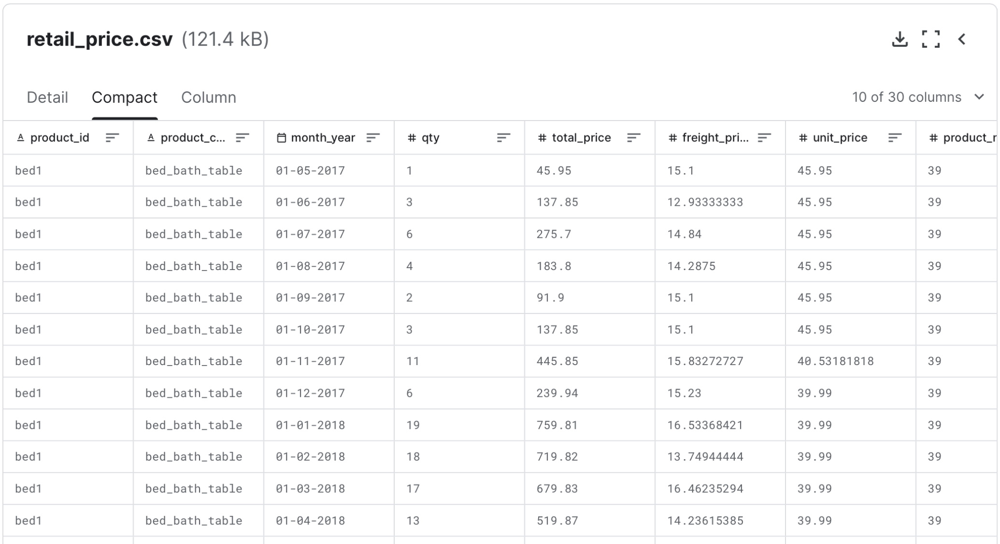
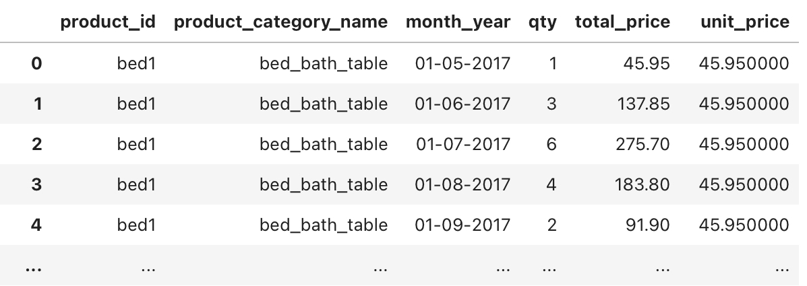
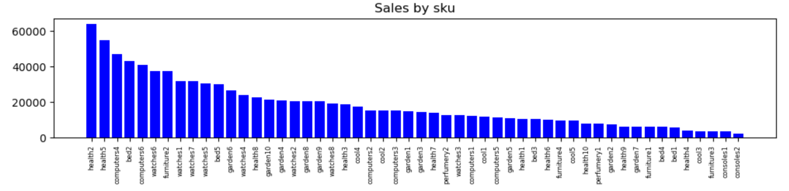
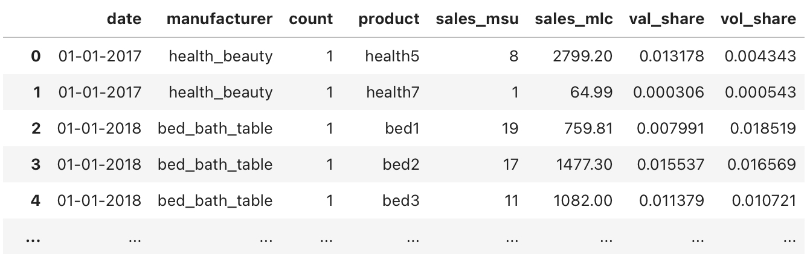
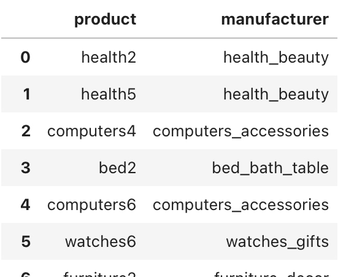
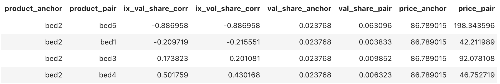
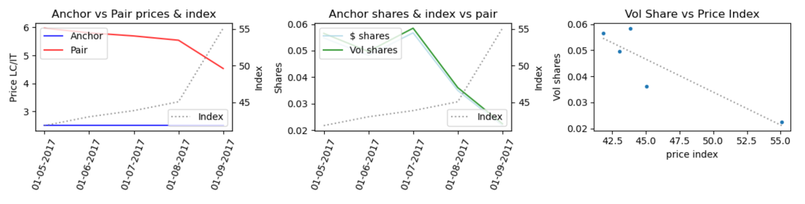
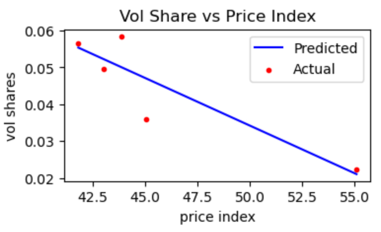

# Pricing Strategy Development  
Identify the pricing strategy against key competitors to optimize profit, based on sales and pricing data.  

This code was used to redesign and automatize the pricing strategy process for one of P&G Categories in a specific Region.  
It leverages Nielsen sales and pricing data and internal financial data from skus.  

For confidentiality purposes, the code shared here does not include any real P&G data. It uses a Kaggle database (link below) instead of Nielsen reports and dummy financial data.  
https://www.kaggle.com/datasets/bhanupratapbiswas/retail-price-optimization-case-study  




## The process includes the following key steps:  

[[PREPARATION IMAGE]]  
**DATA PREPARATION**  
After importing the database, reprocess data into a dataframe with the following relevant columns.  

```
# Keep only useful columns

retail_price = retail_price[['product_id', 'product_category_name',
       'month_year', 'qty', 'total_price', 'unit_price']]
retail_price
```  



[[ANCHOR IMAGE]]  
**IDENTIFY ANCHORS**  
Anchors are the own skus we are building the pricing strategy for.  
Objective is to identify the skus that will drive the most value. The tool helps identify the highest-selling skus, but other strategic skus may be added as needed.  

```
# Function to identify anchors: receives sales by sku dataframe and returs list of top-10 selling skus  

def identify_anchors(df):
    df = df.groupby('product')[['sales']].sum().sort_values('sales', ascending=False)

    limit = df['sales'].sum()*0.001
    df_limited = df[df['sales'] > limit]
    
    plt.figure(figsize=(12,2))
    
    plt.bar(df_limited.index, df_limited['sales'], color='blue')
    plt.title('Sales by sku', fontsize=12)
    plt.xticks(rotation=90, fontsize=6);
    plt.show()

    df_top_10 = df.head(10)
    perc = df_top_10['sales'].sum() / df['sales'].sum()

    print(f"Top 10 represents: {round(perc,2)*100}%")

    return df_top_10.index.to_list()

# Create a 'sales by sku' dataframe that will serve as input for the function that will identify the anchors
sales_by_sku_df = retail_price[['product_id', 'total_price']]
sales_by_sku_df.rename(columns={'product_id': 'product',
                                          'total_price': 'sales'}, inplace=True)

anchors = identify_anchors(sales_by_sku_df)
anchors
```  


From those, you select the top or most strategic ones as an anchors list.

```
anchors = ['bed2',
           'watches6',
           'furniture2']
```


[[PAIRS IMAGE]]  
**IDENTIFY PAIRS**  
Pairs are the competitive skus that have the highest impact on anchor sales.  
Leveraging sales data, we identify the pair with the highest negative correlation between sales and the price-index (anchor vs pair).  


This function will use as input:
- a dataframe (filtered_df) with the following columns: month, manufacturer, count, product, sales_msu, sales_mlc, val_share, vol_share
- a list with the all products (all_products)  
- the anchor product  

filtered_df  


all_products  


```
# Function to identify correlations  

def get_correlation(df, product, all_products):
    df['price'] = df['sales_mlc'] / df['sales_msu']

    # Filter all_products database with same category as anchor
    category = all_products[all_products['product'] == product]['manufacturer'].values[0]
    same_categ_products = all_products[all_products['manufacturer'] == category]

    correlations = pd.DataFrame()    # initiate correlations df
    df1 = df[df['product'] == product]
    sales_mlc_anchor = df1['sales_mlc'].sum()

    for i in range(len(same_categ_products)):
        df2 = df[df['product'] == same_categ_products['product'].values[i]]
        merged_df = df1.merge(df2, left_on='date', right_on='date', suffixes=('_anchor', '_pair'))
        merged_df['price_ix'] = merged_df['price_anchor'] / merged_df['price_pair']
        merged_df[['price_ix', 'val_share_anchor', 'vol_share_anchor']].corr()
        ix_val_share_corr = merged_df['price_ix'].corr(merged_df['val_share_anchor'])
        ix_vol_share_corr = merged_df['price_ix'].corr(merged_df['vol_share_anchor'])
        corr_2 = pd.DataFrame()

        sales_mlc_pair = df2['sales_mlc'].sum()
        
        data = {'product_anchor': [product],
                'product_pair': [same_categ_products['product'].values[i]],
                'ix_val_share_corr': [ix_val_share_corr],
                'ix_vol_share_corr': [ix_vol_share_corr],
                'val_share_anchor': [df1['val_share'].mean()],
                'val_share_pair': [df2['val_share'].mean()],
                'price_anchor': [df1['price'].mean()],
                'price_pair': [df2['price'].mean()],
                'val_share_ix': [round(df1['val_share'].mean() / df2['val_share'].mean(),2)],
                'price_ix': [round(df1['price'].mean() / df2['price'].mean(),2)],
               }
        # columns = ['product_anchor', 'product_pair', 'ix_val_share_corr', 'ix_vol_share_corr', '', '', '', '']
        corr_2 = pd.DataFrame(data)
        correlations = pd.concat([correlations, corr_2])

        correlations.dropna(inplace=True)
        correlations = correlations[(correlations['price_ix'] > 0.5) & (correlations['price_ix'] < 2)]
        correlations = correlations[(correlations['val_share_ix'] > 0.1) & (correlations['val_share_ix'] < 40)]
        correlations = correlations[(correlations['ix_val_share_corr'] < -0.3) & (correlations['ix_val_share_corr'] < -0.3)]
        correlations.sort_values('ix_vol_share_corr', inplace=True)
        
    return correlations
```

For each anchor, run the get_correlations function to identify the best pair.  
```
correlations = get_correlation(filtered_df, anchors[0], all_products)
correlations
```

[[COMPARISON IMAGE]]  
**EVALUATE PAIRS**  
From the list, we select the best pair for each anchor, usually the highest ix_vol_share_corr.  
After identifying the best pair for each anchor, use the evaluate_pairs function.  

```
# Function to evaluate anchor-pair skus  

def evaluate_pairs(df, anchor, pair):
    df1 = df[df['product'] == anchor]
    df2 = df[df['product'] == pair]
    merged_df = df1.merge(df2, left_on='date', right_on='date', suffixes=('_anchor', '_pair'))
    
    merged_df['price_per_it_anchor'] = merged_df['price_anchor'] / (36 / merged_df['count_anchor'].astype(float))
    merged_df['price_per_it_pair'] = merged_df['price_pair'] / (36 / merged_df['count_pair'].astype(float))
    merged_df['index'] = (merged_df['price_per_it_anchor'] / merged_df['price_per_it_pair'])*100
    merged_df.sort_values('date', inplace=True)

    # Create a 3x1 grid of subplots
    fig, axes = plt.subplots(nrows=1, ncols=3, figsize=(12, 3))
    
    ax = axes[0]
    
    ax.plot(merged_df['date'], merged_df['price_per_it_anchor'], label='Anchor', color='blue', alpha=0.8)
    ax.plot(merged_df['date'], merged_df['price_per_it_pair'], label='Pair', color='red', alpha=0.8)
    ax.set_ylabel('Price LC/IT')
    ax.tick_params(axis='x', rotation=70)
    ax.legend(loc='upper left')
    
    ax2 = ax.twinx()
    ax2.plot(merged_df['date'], merged_df['index'], label='Index',  linestyle='dotted', color='grey', alpha=0.8)
    ax2.set_ylabel('Index')
    ax2.legend(loc='lower right')
    
    ax.set_title('Anchor vs Pair prices & index')
    
    
    ax = axes[1]
    
    ax.plot(merged_df['date'], merged_df['val_share_anchor'], label='$ shares', color='lightblue', alpha=0.8)
    ax.plot(merged_df['date'], merged_df['vol_share_anchor'], label='Vol shares', color='green', alpha=0.8)
    ax.set_ylabel('Shares')
    ax.tick_params(axis='x', rotation=70)
    ax.legend(loc='upper left')
    
    ax2 = ax.twinx()
    ax2.plot(merged_df['date'], merged_df['index'], label='Index', linestyle='dotted', color='grey', alpha=0.8)
    ax2.set_ylabel('Index')
    ax2.legend(loc='lower right')
    
    ax.set_title('Anchor shares & index vs pair')
    
    
    ax = axes[2]
    ax.scatter(merged_df['index'], merged_df['vol_share_anchor'] , marker='.')
    
    # Fit a linear regression line
    coefficients = np.polyfit(merged_df['index'], merged_df['vol_share_anchor'], 1)
    trendline = np.poly1d(coefficients)
    x = np.linspace(min(merged_df['index']), max(merged_df['index']), 100)
    ax.plot(x, trendline(x), color='grey', linestyle='dotted', label='Trendline', alpha=0.8)
    
    ax.set_ylabel('Vol shares')
    ax.set_xlabel('price index')
    ax.set_title('Vol Share vs Price Index')
    
    plt.tight_layout()
    plt.show()
    
    return merged_df
```

By running the evaluate_pairs function, we get:
- the evolution of prices (LC/IT) and of Price Index (anchor price / pair price)
- the evolution of anchor value and volume shares  
- the plot and trendline of shares vs prices  

```
anchor = anchors[0]
pair = 'bed5'

merged_df = evaluate_pairs(filtered_df, anchor, pair)
```




From the dataframe returned from the evaluate_pairs function, get a linear regression model to predict approximated volume shares for each price index.  

```
def get_linear_model(df):

    X = df[['index']]
    y = df['vol_share_anchor']

    X_train, X_test, y_train, y_test = train_test_split(X,y,test_size=0.2, random_state=41)

    model = LinearRegression()

    model.fit(X_train, y_train)
    # print(model.score(X_test, y_test))
    
    plt.figure(figsize=(4,2))

    y_predicted = model.predict(df[['index']])

    plt.plot(df['index'], y_predicted, color='blue', label='Predicted')
    plt.scatter(df['index'], df['vol_share_anchor'], marker='.', color='red', label='Actual')
    plt.legend()

    plt.ylabel('vol shares')
    plt.xlabel('price index')
    plt.title('Vol Share vs Price Index')
    plt.show()

    return model

model = get_linear_model(merged_df)
```



**IDENTIFY OPTIMAL PRICE INDEX VS PAIR FOR EACH ANCHOR**  
Modeling the sales (or shares) per price-index vs pair, and including internal financial structure of anchor skus, we can identify the price-index vs pair that will result in highest sales or profit.  

This step uses a fuction with the following inputs:  
- financials dataframe  
- the merged_df from the evaluate_pairs function
- the anchor product  

```
# Financials dataframe
data = {
    'PRODUCT NAME': ['bed2', 'watches6', 'furniture2'],
    'LP per IT': [80, 110, 60],
    'NOS per SU': [75, 100, 50],
    'TDC per SU': [30, 55, 40]
}
```

```
def find_optimal_ix(financials, merged_df, anchor):
    anchor_base_lp = financials[financials['PRODUCT NAME'] == anchor.strip()]['LP per IT'].values[0]
    anchor_nos_per_su = financials[financials['PRODUCT NAME'] == anchor.strip()]['NOS per SU'].values[0]
    anchor_tdc_per_su = financials[financials['PRODUCT NAME'] == anchor.strip()]['TDC per SU'].values[0]
    # print(f'list price lc per it {anchor_base_lp}')
    # print(f'nos $ per su {anchor_nos_per_su}')
    # print(f'tdc $ per su {anchor_tdc_per_su}')

    # min = round(merged_df['index'].min()/10,0)*10
    # max = round(merged_df['index'].max()/10,0)*10
    min = 10
    max = 200
    # outer_range = (max - min)/2
    # tick = ((max + outer_range) - (min - outer_range))/5
    # tick = tick.astype(int)
    index_scenarios = [(min)]
    for i in range(34):
        index_scenarios.append((min) + (i+1)*5)

    merged_df_period = merged_df

    anchor_base_price_point = (merged_df_period['sales_mlc_anchor'].sum() / merged_df_period['sales_msu_anchor'].sum()) / \
                (36 / int(merged_df['count_anchor'][0]))
    pair_base_price_point = (merged_df_period['sales_mlc_pair'].sum() / merged_df_period['sales_msu_pair'].sum()) / \
                (36 / int(merged_df['count_pair'][0]))
    anchor_base_vol_share = model.predict([[(anchor_base_price_point / pair_base_price_point)*100]])[0]

    merged_df_year = merged_df

    anchor_yr_vol = merged_df_year['sales_msu_anchor'].sum()

    # print(f'index scenarios {index_scenarios}')
    # print(f'anchor vol share {anchor_base_vol_share}')
    # print(f'anchor year volume {anchor_yr_vol}')
    # print(f'anchor price {anchor_base_price_point}')
    # print(f'pair price {pair_base_price_point}')

    scenarios_df = pd.DataFrame(index=index_scenarios)
    
    for i, index in enumerate(index_scenarios):
        scenarios_df.at[index, 'price_point_lc'] = round(pair_base_price_point * index / 100, 2)
        scenarios_df.at[index, 'gs_lc_per_it'] = round(anchor_base_lp *
                                                       scenarios_df.at[index, 'price_point_lc'] /
                                                       anchor_base_price_point, 2)
        scenarios_df.at[index, 'vol_share'] = model.predict([[index]])[0]
        scenarios_df.at[index, 'incr_vol'] = (anchor_yr_vol * scenarios_df.at[index, 'vol_share'] / anchor_base_vol_share) - \
                                        anchor_yr_vol
        
    #         print(f'index: {index}')
    #         print(f'pair_sku_current_price_point: {pair_sku_current_price_point}')
    #         print(f'base_sku_yr_msu: {base_sku_yr_msu}')
    #         print(f'base_sku_vol_share: {base_sku_vol_share}')
    #         print(f"scenario vol share: {scenarios_df.at[index, 'vol_share']}")
        
        scenarios_df.at[index, 'nos_per_su'] = anchor_nos_per_su * \
                                        scenarios_df.at[index, 'price_point_lc'] / \
                                        anchor_base_price_point
        scenarios_df.at[index, 'incr_nos'] = (anchor_yr_vol * scenarios_df.at[index, 'vol_share'] / anchor_base_vol_share) * \
                                        scenarios_df.at[index, 'nos_per_su'] - \
                                        (anchor_yr_vol * anchor_nos_per_su)
        scenarios_df.at[index, 'gm_%'] = '{:.2%}'.format((scenarios_df.at[index, 'nos_per_su'] - anchor_tdc_per_su) /
                                        scenarios_df.at[index, 'nos_per_su'])
        scenarios_df.at[index, 'incr_gm'] = ((scenarios_df.at[index, 'nos_per_su'] - anchor_tdc_per_su) *
                                        (anchor_yr_vol * scenarios_df.at[index, 'vol_share'] / anchor_base_vol_share)) - \
                                        ((anchor_nos_per_su - anchor_tdc_per_su) * 
                                        anchor_yr_vol)
    
    fig, ax1 = plt.subplots(figsize=(4, 2))
    
    ax1.plot(scenarios_df.index, scenarios_df['incr_nos'], label='incr nos', color='blue', alpha=0.8)
    ax1.plot(scenarios_df.index, scenarios_df['incr_gm'], label='incr gc', color='green', alpha=0.8)
    
    ax1.set_ylabel('$M')
    ax1.legend(loc='lower left')
    
    ax2 = ax1.twinx()
    ax2.plot(scenarios_df.index, scenarios_df['incr_vol'], label='incr vol', color='black', alpha=0.8)
    ax2.set_ylabel('MSU')
    ax2.legend(loc='upper right')
    
    max_incr_nos = scenarios_df['incr_nos'].max()
    max_incr_gm = scenarios_df['incr_gm'].max()
    
    max_incr_nos_index = scenarios_df.index[scenarios_df['incr_nos'] == max_incr_nos].tolist()
    max_incr_gm_index = scenarios_df.index[scenarios_df['incr_gm'] == max_incr_gm].tolist()
    
    print(f"Max incr_nos: {max_incr_nos:.2f}, Index: {max_incr_nos_index}")
    print(f"Max incr_gc: {max_incr_gm:.2f}, Index: {max_incr_gm_index}")
    
    highlight_max_nos = max_incr_nos_index
    highlight_max_gm = max_incr_gm_index
    
    ax1.axvline(x=highlight_max_nos, color='blue', linestyle='dotted', alpha=0.3)
    ax1.axvline(x=highlight_max_gm, color='green', linestyle='dotted', alpha=0.3)
    
    # # Set y-axis limits symmetrically around zero
    # y1_min, y1_max = ax1.get_ylim()
    # y1_lim = max(abs(y1_min), abs(y1_max))
    # ax1.set_ylim(-y1_lim, y1_lim)
    
    # y2_min, y2_max = ax2.get_ylim()
    # y2_lim = max(abs(y2_min), abs(y2_max))
    # ax2.set_ylim(-y2_lim, y2_lim)
    
    # Add horizontal line at zero position on y-axis
    ax1.axhline(y=0, color='black', linestyle='dotted', alpha=0.1)
    
    plt.title('Incr NOS, GC, Vol scenarios')
    plt.show()

    return scenarios_df

find_optimal_ix(financials, merged_df, anchor)
```




For each anchor:
- run the **get_correlations** function to identify the best pair for each anchor  
- run the **evaluate_pairs** and the **get_linear_model** functions to update the regression model
- and finally run the **find_optimal_ix**  


[[RESULTS IMAGE]]  
**OUTCOMES**  
This exercise will provide inputs for a recommendation on:  
- Best anchors to select  
- Ideal pairs for each anchor  
- Price index for each anchor vs pair, optimized for sales or profit  
